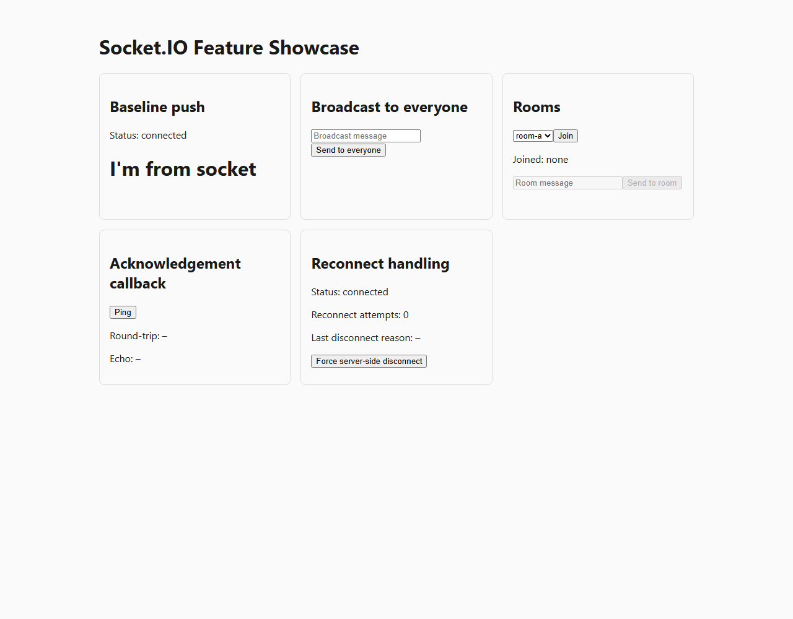
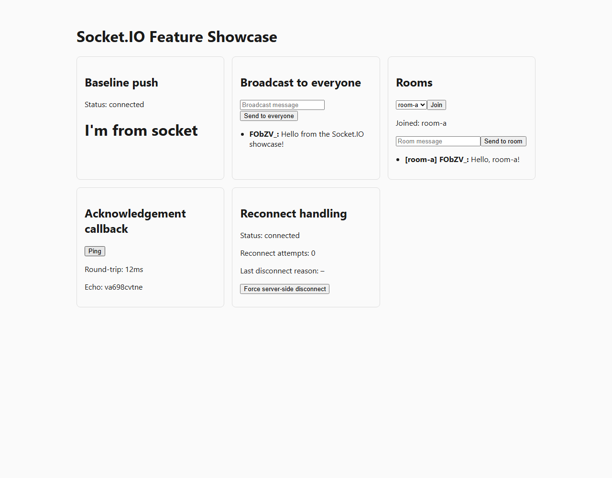
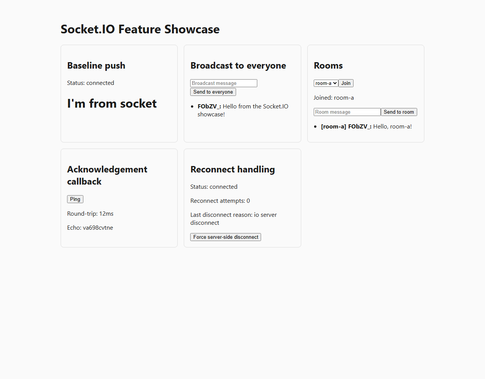

# Socket io
[](https://ci.appveyor.com/project/Mahadenamuththa/socketlistnersample/branch/master)

[](https://ci.appveyor.com/project/Mahadenamuththa/socketlistnersample/history)


This repo is a **learning project**: a minimal Express + Socket.IO server paired with a React client, used to demonstrate — one panel at a time — the core things Socket.IO can do. This README walks through *how* it's built, step by step, with the actual code, and how to run it yourself.

## What is a WebSocket?

A normal HTTP request/response is one-directional: the client asks, the server answers, done. A WebSocket is a single long-lived connection that both sides can send messages over, at any time, in either direction — which is what lets a server *push* data to the browser without being asked. Socket.IO is a library built on top of WebSockets (with an automatic fallback to HTTP polling, reconnection handling, rooms, and acknowledgements) that makes this practical to use from both Node and the browser.

## How this project is built, step by step

### 1. A monorepo with three packages

The project is an npm workspace (`package.json` → `"workspaces": ["packages/*"]`) with three packages, orchestrated by [Turborepo](https://turborepo.com) so `npm run build`/`test`/`dev` at the root fan out to all of them:

```
packages/
├── shared/   the Socket.IO event contract — no build step, imported as TypeScript source
├── server/   Express + Socket.IO, run directly with tsx
└── client/   React + Vite
```

### 2. Define the event contract once, share it both ways

Before writing any client or server code, `packages/shared/src/socket-events.ts` declares every event name and payload shape as TypeScript types:

```ts
export interface ServerToClientEvents {
  welcome: (payload: { message: string; timestamp: number }) => void;
  'broadcast:message': (payload: { from: string; text: string; timestamp: number }) => void;
  'room:message': (payload: { room: string; from: string; text: string; timestamp: number }) => void;
}

export interface ClientToServerEvents {
  'client:broadcast': (payload: { text: string }) => void;
  'room:join': (payload: { room: string }, ack: (res: { ok: true; room: string }) => void) => void;
  'room:message': (payload: { room: string; text: string }) => void;
  'ack:ping': (payload: { nonce: string; sentAt: number }, ack: (res: { echo: string; serverTime: number }) => void) => void;
  'debug:disconnectMe': () => void;
}
```

Both the server and the client import this as `@socketlistenersample/shared`. Get an event name or payload shape wrong on either side, and it's a compile error, not a runtime surprise.

### 3. The server: one `io.on('connect', ...)` block per feature

`packages/server/src/index.ts` creates the Socket.IO server and, for each connected client, wires up one handler per feature. `createApp()` returns `{ app, httpServer, io }` without starting to listen — the file only binds a port when it's run directly — so tests can start the same server on a random free port:

```ts
export function createApp() {
  const app = express();
  app.use(cors({ origin: CLIENT_ORIGIN }));

  const httpServer = createHttpServer(app);
  const io = new Server<ClientToServerEvents, ServerToClientEvents, InterServerEvents, SocketData>(httpServer, {
    cors: { origin: CLIENT_ORIGIN },
  });

  io.on('connect', (socket) => {
    // Baseline: push a message once on connect.
    socket.emit('welcome', { message: "I'm from socket", timestamp: Date.now() });

    // Broadcast: relay to every connected client, including the sender.
    socket.on('client:broadcast', ({ text }) => {
      io.emit('broadcast:message', { from: socket.id, text, timestamp: Date.now() });
    });

    // Rooms: join a room (ack-confirmed), then send messages scoped to it.
    socket.on('room:join', ({ room }, ack) => {
      socket.join(room);
      ack({ ok: true, room });
    });
    socket.on('room:message', ({ room, text }) => {
      io.to(room).emit('room:message', { room, from: socket.id, text, timestamp: Date.now() });
    });

    // Ack callback: round-trip request/response.
    socket.on('ack:ping', ({ nonce }, ack) => {
      ack({ echo: nonce, serverTime: Date.now() });
    });
  });

  return { app, httpServer, io };
}
```

### 4. The client: connect once, track state outside React

`packages/client/src/socket/client.ts` opens the connection at module load — `io(SERVER_URL, { ... })` — as a single shared instance, not something created inside a component. That module also keeps a small external store (`connected`, the last `welcome` payload, reconnect info), updated the moment any relevant event fires:

```ts
export const socket: Socket<ServerToClientEvents, ClientToServerEvents> = io(SERVER_URL, {
  autoConnect: true,
  reconnectionAttempts: 5,
  reconnectionDelay: 1000,
});

socket.on('connect', () => updateSnapshot({ connected: true, reconnectAttempts: 0 }));
socket.on('welcome', (payload) => updateSnapshot({ lastWelcome: payload }));
```

> **A real bug caught along the way:** the socket connects the instant this module loads — often *before* React has even mounted. A component that only listens with `useEffect(() => socket.on(...), [])` can miss the very first `connect`/`welcome` events, since `useEffect` runs after the initial render. The fix was to track state at module scope (above) and read it with React's [`useSyncExternalStore`](https://react.dev/reference/react/useSyncExternalStore) instead of a plain `useEffect` + `useState` pair — that way a component picks up whatever already happened *and* stays subscribed to what happens next:

```tsx
export function BaselinePanel() {
  const { connected, lastWelcome } = useSyncExternalStore(subscribeConnection, getConnectionSnapshot);
  return (
    <section className="panel">
      <h2>Baseline push</h2>
      <p>Status: {connected ? 'connected' : 'disconnected'}</p>
      <h1>{lastWelcome?.message ?? '–'}</h1>
    </section>
  );
}
```

### 5. One React component per feature

Each remaining panel is a small component that emits on user action and listens for the matching reply — e.g. `packages/client/src/components/BroadcastPanel.tsx`:

```tsx
const send = () => {
  if (!text.trim()) return;
  socket.emit('client:broadcast', { text });
  setText('');
};

useEffect(() => {
  const handleBroadcast = (payload) => setLog((prev) => [...prev, payload].slice(-10));
  socket.on('broadcast:message', handleBroadcast);
  return () => socket.off('broadcast:message', handleBroadcast);
}, []);
```

This plain `useEffect` pattern is fine here (unlike the baseline panel above) because these events only ever happen *after* a user clicks something — there's no "missed the first event" race to worry about.

### 6. Tests for both sides

- `packages/client/src/__tests__/App.test.tsx` — renders the app against a fake socket (a tiny fake event emitter, see `test-utils/fakeSocket.ts`) and asserts the UI reacts correctly.
- `packages/server/src/__tests__/socket-server.test.ts` — starts the *real* server via `createApp()` on an ephemeral port and drives it with real `socket.io-client` connections, checking broadcast fan-out, room isolation, ack round-trips, and reconnect behavior.

## Feature showcase

| Panel | Client → Server | Server → Client | What it shows |
|---|---|---|---|
| Baseline | — | `welcome` | The server pushes a message as soon as a client connects. |
| Broadcast | `client:broadcast` | `broadcast:message` | `io.emit(...)` fans a message out to every connected client, including the sender. |
| Rooms | `room:join` (ack), `room:message` | `room:message` | `socket.join(room)` + `io.to(room).emit(...)` — messages only reach clients in that room. |
| Ack callback | `ack:ping` (ack) | — (via callback) | A request/response round trip using Socket.IO's acknowledgement callbacks, with measured latency. |
| Reconnect | `debug:disconnectMe` | — | Forces a server-side disconnect. Socket.IO doesn't auto-reconnect after a *server-initiated* disconnect, so the client detects that specific reason and reconnects manually. |

## Screenshots

App just loaded — the server has already pushed its baseline `welcome` message:



After sending a broadcast, joining `room-a` and sending a room message, and pinging for an ack round-trip:



After clicking "Force server-side disconnect" — the reconnect panel shows the disconnect reason and that the client is back to `connected`:



## Running it yourself

You'll need [Node.js 24 (LTS)](https://nodejs.org/en/download/).

```
npm install     # installs every package in the workspace
npm run dev     # starts the client (http://localhost:5173) and server (http://localhost:6600) together
```

Open `http://localhost:5173` in a browser and try each panel — open a second tab to see broadcast/rooms fan out across clients.

Other root-level scripts (each fans out to every package via Turborepo):

```
npm run build   # type-check + build every package
npm test        # run every package's test suite once
npm run lint    # lint the whole workspace
```

Scripts scoped to one package:

```
npm run dev --workspace=@socketlistenersample/client
npm run dev --workspace=@socketlistenersample/server
npm run start --workspace=@socketlistenersample/server   # run the server once, no watch mode
```

## CI

AppVeyor builds and tests `shared`, `server`, and `client` as explicit, separate steps on Node 24, then publishes each package's Vitest results (JUnit XML) to AppVeyor's Tests tab and the client's production build as a build artifact. See `appveyor.yml`.
